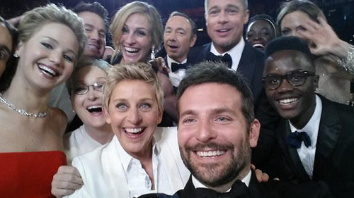

# Su-Ng.github.io
=================

My Github user page is at:
https://github.com/Su-Ng/

My Github Pages rep can be found at:
https://github.com/Su-Ng/Su-Ng.github.io/

And soon you'll see my customised homepage at:
http://Su-Ng.github.io

The purpose of this work is to showcase some state of the art computer vision application using Amazon Rekognition.

Demo
### Detect Text 

   

Detected Text

Northumberland Rd : 92.31%

Northumberland    : 9.86%

Rd                : 88.76%  

### Detect Objects from the Scene

Human           : 99.2%

People          : 99.2%

Person          : 99.27%

Skateboard      : 98.24%

Sport           : 98.24%

Sports          : 98.24%

  
### Detect Face

Female

Smile

Male

Glasses

Smile

Beard

### Detect Celebrities

Detected Celebrities

Bradley Cooper    : 100%

Jennifer Lawrence : 60%

Ellen DeGeneres   : 100%

Wayne Wonder      : 90.0%
